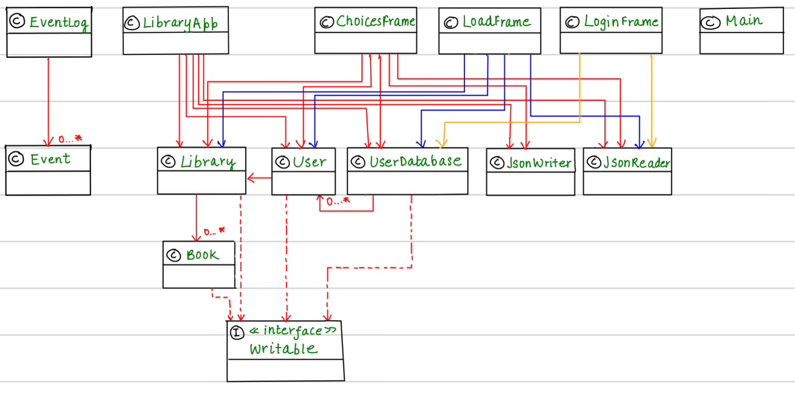

# Library Management System

## Optimizing Libraries

In this era of Internet, web-based applications have become indispensable
tools that support our daily routines. Currently, I am developing a Library Management
System which aims at efficiently handling and coordinating different aspects of a library's operations,

- **Book Cataloging :** Enabling users to categorize book details, encompassing book title, author, genre, release date and availability date.

- **Circulation Management :** Streamlining the tracking of book borrowing and returns, ensuring a smooth circulation process.

- **User Management :** Effectively managing library members and maintaining a comprehensive borrowing history for each individual.

The application can be used by *library members* to 
access the library's catalog, and check availability of books. It saves time and effort in physically visiting the library to find a specific item. 

My interest in Library Management System project stems from a passion for literature. I recognize its significance 
in shaping young minds and fostering empathy. Furthermore, its potential to streamline and automate various tasks in a library, making 
operations more user-friendly intrigues me. Therefore, this system not only aligns with my love for the written word but also represents a step towards a more
user-centric and efficient library experience.

***USER STORIES :***

- As a user, I want to be able to view the information of a particular book in the library.
- As a user, I want to be able to view all the books in the library of a specific genre.
- As a user, I want to be able to borrow and return books based on their availability.
- As a user, I want to be able to maintain a comprehensive borrowing history for each individual.
- As a user, I want to be able to save my changes.
- As a user, I want to be able to load my changes.


***INSTRUCTIONS FOR GRADER :***

- User can borrow or return a book by clicking the "Borrow a book" or "Return a book" respectively,
  which results in the addition of book in borrowed books by user, and alters the list of books in the library.
- All the books of a specific genre (present in the library) can be viewed by clicking the button "View the books"
- The visual components can be found in a directory named "Images".
- After logging in, user can decide whether to load the data or not by clicking the "yes" or "no" button.
- User can save the file, by clicking the "Save" button.


***PHASE 4: TASK 2***
````
Tue Nov 28 21:59:20 PST 2023
Book with ID: 2 borrowed by User: Ruhani
Tue Nov 28 22:01:16 PST 2023
Book with ID: 4 borrowed by User: Ruhani
Tue Nov 28 22:01:32 PST 2023
Book with ID: 2 returned by User: Ruhani
Tue Nov 28 22:01:53 PST 2023
Book with ID: 5 borrowed by User: Ruhani
````

***PHASE 4: TASK 3***

- The UML diagram indicates a certain level of complexity in the Library and UserDatabase classes, particularly with the
  handling of lists of books and users. To simplify and improve the design, I can use the Iterator design pattern.
- I can try to reduce the duplication in GUI in classes.

